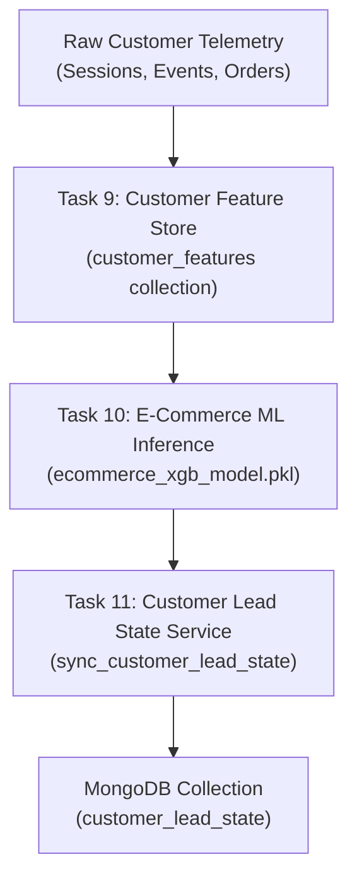

# Task 11 — Customer-Level Lead State Layer Documentation

> **DISCLAIMER**: The lead qualification rules and thresholds (`qualified >= 0.70`, `Hot >= 0.70`, `Warm 0.35–0.70`, `Cold < 0.35`) are **PROVISIONAL** guidelines derived from generic synthetic e-commerce dataset training. Thresholds will be re-tuned when production customer order telemetry accumulates.

---

## 1. Overview & Purpose
Task 11 establishes a persistent **Customer-Level Lead State** layer stored in the MongoDB collection `customer_lead_state`.

While Task 10 created on-demand ML inference capabilities, Task 11 introduces a stateful business layer that:
- Stores the single current lead state of each canonical registered customer.
- Evaluates qualification status (`qualified` vs `not_qualified`).
- Tracks state and segment transitions over time (`not_qualified_to_qualified`, `qualified_to_not_qualified`).
- Preserves the customer's `first_qualified_at` timestamp across re-scoring iterations.
- Guarantees 1-to-1 idempotency (One Registered Customer = One Lead State Document).

---

## 2. Architecture & Data Flow



---

## 3. MongoDB Collection Schema (`customer_lead_state`)

### Unique Index
- **Index Name**: `customer_id_1`
- **Specification**: `{"customer_id": 1}`
- **Constraint**: `unique=True` (Guarantees exactly one lead state record per canonical customer).

### Document Fields
```json
{
  "_id": "ObjectId('6aae93dad84819246a37267d')",
  "customer_id": "ObjectId('6aae287889fa871c2904c1b5')",

  "lead_probability": 0.8245,
  "lead_score": 82,
  "lead_segment": "Hot",
  "qualification_status": "qualified",
  "model_version": "v2.0_ecommerce_xgb",

  "previous_probability": 0.6410,
  "previous_score": 64,
  "previous_segment": "Warm",
  "previous_qualification_status": "not_qualified",

  "qualification_transition": "not_qualified_to_qualified",
  "is_newly_qualified": true,
  "segment_changed": true,

  "first_qualified_at": "2026-09-19T13:53:30.388165+00:00",
  "last_qualified_at": "2026-09-19T13:53:30.388165+00:00",
  "last_scored_at": "2026-09-19T13:53:30.388165+00:00",
  "created_at": "2026-09-19T13:53:30.388165+00:00",
  "updated_at": "2026-09-19T13:53:30.388165+00:00"
}
```

---

## 4. Qualification Rules & Segment Thresholds

### Initial Qualification Business Rule
- **`qualified`**: `lead_probability >= 0.70` (Customer in `Hot` intent tier).
- **`not_qualified`**: `lead_probability < 0.70` (Customer in `Warm` or `Cold` intent tier).

### Provisional Segment Tiers
- **`Hot`**: `lead_probability >= 0.70`
- **`Warm`**: `0.35 <= lead_probability < 0.70`
- **`Cold`**: `lead_probability < 0.35`

---

## 5. State Transition & Timestamp Logic

### Transition Types
1. `none_to_qualified` / `none_to_not_qualified`: Initial scoring event for a new customer.
2. `not_qualified_to_qualified`: Customer intent increases to $\ge 0.70$. `is_newly_qualified` = `true`.
3. `qualified_to_not_qualified`: Customer intent drops below $0.70$.
4. `qualified_to_qualified`: Customer re-scored while remaining qualified.
5. `not_qualified_to_not_qualified`: Customer re-scored while remaining unqualified.

### Timestamp Lifecycle
- **`first_qualified_at`**: Recorded on the first transition to `qualified`. **NEVER overwritten** on subsequent re-scoring or re-qualification cycles.
- **`last_qualified_at`**: Updated whenever the customer is scored in a `qualified` state.
- **`last_scored_at` / `updated_at`**: Updated on every synchronization event.

---

## 6. Idempotency Guarantees
- Synchronization uses PyMongo `update_one` with `upsert=True` against the unique `customer_id` index.
- Executing `sync_customer_lead_state` repeatedly on the same customer updates the single document without generating duplicate records.

---

## 7. API Endpoints

### 1. `GET /api/customer/lead-state`
- **Access**: Customer (`@token_required`).
- **Authorization**: Strictly reads `g.current_user["sub"]` from JWT claims. Ignores request parameters trying to query another customer's ID.
- **Response**: `200 OK` with lead state document, or `404 Not Found` if unsynchronized.

### 2. `POST /api/customer/lead-state/sync`
- **Access**: Customer (`@token_required`).
- **Behavior**: Executes `sync_customer_lead_state` for authenticated user and returns updated state document.

### 3. `GET /api/admin/customer-lead-state/<customer_id>`
- **Access**: Admin (`@admin_required`).
- **Response**: `200 OK` with customer lead state document. Returns `403` for non-admin tokens, or `404` if not found.

### 4. `POST /api/admin/customer-lead-state/<customer_id>/sync`
- **Access**: Admin (`@admin_required`).
- **Behavior**: Executes lead state synchronization for specified customer and returns updated state document.

---

## 8. Verification & Test Results
- **Focused Test Suite** ([`backend/tests/test_customer_lead_state.py`](file:///d:/lead-magnet/backend/tests/test_customer_lead_state.py)): **28 passed, 0 failed**.
- **Full Backend Test Suite** (Run 1 & Run 2): **131 passed, 0 failed**.
- **Read-Only Local Verification**: Verified on local MongoDB for `test@gmail.com`. Customer features and historical `leads` records remained 100% untouched.

---

## 9. Security & Legacy Immutability
- **Security**: Strict JWT authorization, prevention of cross-customer data access, safe ObjectId parsing, and administrative role validation.
- **Legacy Protection**: Historical `leads` collection, legacy education ML model (`model_adapter.py`, `prediction_service.py`), and raw telemetry services remain intact.
- **Zero Marketing Side-Effects**: Task 11 establishes state representation **ONLY**. No emails, SMS, WhatsApp messages, or background tasks were created or executed.
